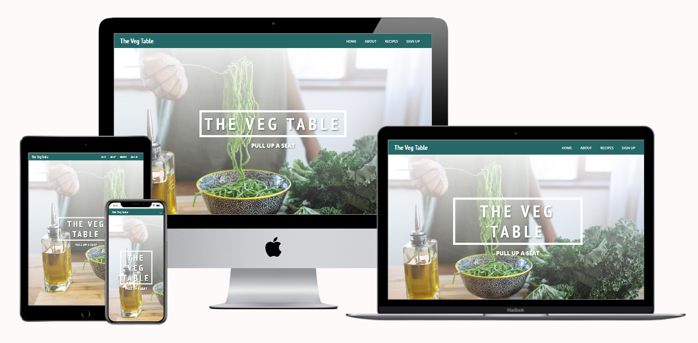
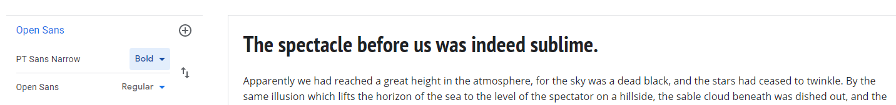
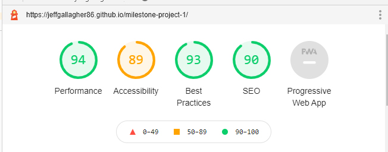
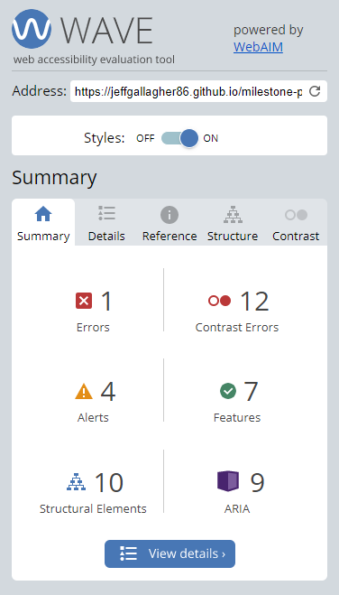
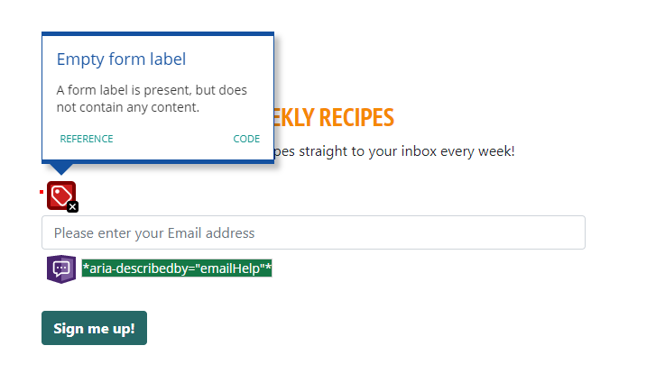
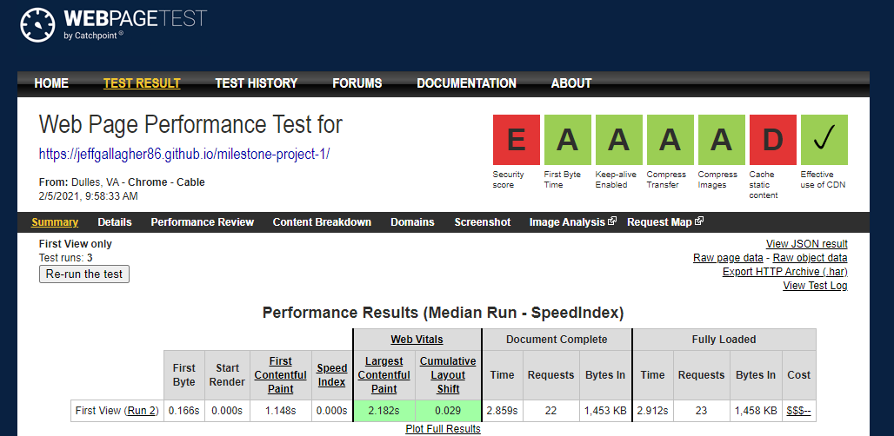
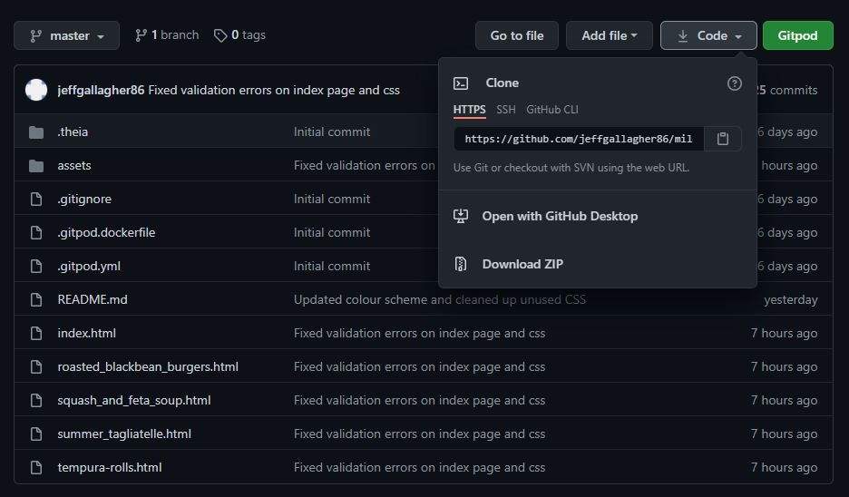

# The Veg Table

The Veg Table is a vegetarian food website which seeks to cater to vegetarians and also people who may wish to become vegetarian or simply for people who may wish to introduce more veggie dishes into their lives.

[View Live Website Here](https://jeffgallagher86.github.io/milestone-project-1/)

# UX
## User Stories
---
### First Time user

As a user:

1. I want the design of the site to make a good impression on me.
2. I want to understand the purpose of the site.
3. I want to know how/why this site stands out from others in it's field.
4. I want to be able to easily navigate through the site.
5. I want to find recipe's that i haven't seen on competitor sites.
6. I want to find out which social media platforms the company is active on so i can have a browse.

### Returning & Frequent User

1. I want to see what new content has been added to the site i.e recipes, video tutorials, photos etc.
2. I want to follow the company on social media
3. I want to see which new features have been added to the site.
4. I want to be absle to sign up for an email newsletter so i can recieve new recipes directly by email.
5. I want to be able to engage with the site owners to give feedback or request certain content.

### Site Owner

As the site owner:

1. I want to be able to provide my own recipes and recipes from guest contributers on a regular basis.
2. I want to be able to get as many customers to follow us across our socials and sign up for our newsletter with a view to growing a membership with a view to possibly providing premium content further down the line.
3. I want to be able to angage with users through our social media platforms so we can keep track of feedback to make an improvements necessary.

___

# Design Choices

### Colour Scheme

My aim with the colour scheme of the site was for the aesthetic to reflect the natural and healthy food which we are promoting. The green tones are associated with health, tranquility, power and nature. Greens are used to relax customers and promote environmental issues. 

The colour green stimulates harmony in your brain and encourages a balance leading to decisiveness. The Orange tones are to encourage feelings of joy, warmth, heat, sunshine, enthusiasm, health, stimulation and happiness.

My overall aim with the colour scheme of the site is to create an autumnal feel the aim being to comfort the user with a warm sense of familiarity. The images i have used were chosen to work in harmony with the overrall colour scheme.

Colour scheme was used courtesy of the [Hook Agency](https://hookagency.com/).

### Typography

The fonts i have used were chosen to both eye catching and funtional. I think the PT Sans Narrow font adds and hint of pizzazz to the site with Open Sans a much more funtional counterbalance.

[Google Fonts](https://fonts.google.com/): PT Sans Narrow & Open Sans

## Wireframes 

Here are my original wireframe mockups.

* [Balsamiq Wireframes PDF](https://github.com/jeffgallagher86/milestone-project-1/blob/master/assets/Docs/Milestone%201%20Large%20screen.pdf)

I like to think i havent diverted too musch from my original idea for the site(aside from the various title changes). 

* I had originally planned to have a carousel for my landing page but i found it to look outdated so i switched that out for the landing page with the gradient and text overlay or a more modern look and i am pleased with the result.

* On the individual recipe page i have added a related recipe section on reccomendation from my mentor Akshat Garg, this was great advice which and something i should have thought of originally.about-me

* I think i have stayed true to my orginal idea with the look being similar across all screen resolutions.

## Mobile First Design

* While building this site as the focus with bootstrap is a mobile first approach i was conscious of my page looking responsive across a variety of media devices. This was something i was extremely vigilent with. 

There were issues with the heading overlay on the hero image outsizing the screen resolution when switched to landscap mode on some of the smaller mobile devices. I remedied this with Media Queries as shown below.

---

@media screen and (max-width: 800px) and (max-height: 450px) {
    .hero-img-inner h1 {
        font-size: 50px;
    }

    .hero-subheading {
        margin: 10px;
        font-size: 20px;
    }
}

@media screen and (max-width: 430px) and (max-height: 645px) {
    .hero-img-inner h1 {
        font-size: 50px;
    }

    .hero-subheading {
        margin: 10px;
        font-size: 20px;
    }
}

---

* There were also issues with the recipe thumbnails being too large for landscape mode on mobile devices. I tried to remedy this by reducing the cols but this made the columns un even and only one thumbnail wrapped below the other three on top. I then fixed this by including a column break so that two thumbnails would show above and below. I did this with the below code:

`

`

---

# Features

* Eye catching mobile first design

* Easy to navigate

* Social Media links

* A sign-up form

## Future Scope

* Introduction of video cooking demos & tutorials on site with links to socials.

* Detailed Nutritional information for each recipe.

* Different categories for each type of meal, ingredient, region etc.

* Create a tagging system for each recipe which would link to recipes with similar tags.

* Premium content subscription service.

# Technologies Used

## Languages Used

* [HTML](https://en.wikipedia.org/wiki/HTML5)
* [CSS](https://en.wikipedia.org/wiki/CSS)

# Frameworks, Libraries, Programs and Sites.

* [Bootstrap](https://getbootstrap.com/) - used for Navbar, grid system and styling throughout the site.

* [Photoshop](https://www.adobe.com/ie/products/photoshop.html) - for image editing.

* [Balsamiq](https://balsamiq.com/) - for wireframes.

* [tinypng](https://tinypng.com/) - to reduce the size of the images used.

* [FontAwesome](https://fontawesome.com/) - for the icons used on the site.

* [Google Fonts](https://fonts.google.com/) - for the fonts used.

* [Unsplash](https://unsplash.com/) - for some of the images used on the site.

* [GitHub](https://github.com/) - to host and publish the site.

* [Gitpod](https://gitpod.io/) - Used for version control by utilizing the Gitpod terminal to commit to Git and Push to GitHub.

# Testing

## Code Validation

I used W3 Schools code validators for the HTML and CSS, there are no errors in the HTML. 

There are errors in the CSS which can be attributed to the boostrap used on the site. There was one error in the CSS i had written.

`.social-links {
    text-align: "center";
}`

I have remedied this by removing the quotation marks around center, as follows:

`.social-links {
    text-align: center;
}`

[w3 HTML Validator Results](https://validator.w3.org/nu/?doc=https%3A%2F%2Fjeffgallagher86.github.io%2Fmilestone-project-1%2F)

[Jigsaw CSS Validator Results](https://jigsaw.w3.org/css-validator/validator?uri=https%3A%2F%2Fjeffgallagher86.github.io%2Fmilestone-project-1%2F&profile=css3svg&usermedium=all&warning=1&vextwarning=&lang=en#errors)

---

## Lighthouse and WAVE Web Accessibility Reports

* I am happy with the results of my lighthouse accessibilty reports for both Desktop and Mobile resapectively below, the only real issues i have come accross here are the colour contrast issues on the site, i weighed up the pros and cons of switching the colours, but i have decided to stick with my guns and not compromise on the aesthetic of the site.

* The only error in my WAVE report(aside from the contrast issues) was due to an ampty form label in my sign up section, i have sing removed this as i found it more visually pleasing and just as effective to use the placeholder text as an instruction for the Email Sign-up.

* I also conducted a Web Page Performance test. I was pleased with the results noting that website security is something i need to look into going forward.

# Deployment

## Publishing Project

This project was deployed to [GitHub](https://github.com/) pages as follows

1. Log-in to GitHub and open the repo for [MS1 The Veg Table](https://github.com/jeffgallagher86/milestone-project-1)
2. Locate and click on the Settings button at the top of the page.
3. Scroll down to the GitHub Pages section on the settings page.
4. Under "Source", click the dropdown called "None" and select "Master Branch".
5. The page will refresh.
6. Scroll down through the page to locate the now published site in the GitHub Pages section to retrieve the link.

## Cloning Project 

1. Log-in to GitHub and open the repo for [MS1 The Veg Table](https://github.com/jeffgallagher86/milestone-project-1)
2. Locate and click on the code section at the top of the page.
3. Click the code button as shown below to show copy of URL

4. Open Git bash terminal.
5. Change the current working directory to the location where you want the cloned directory.
6. Type in "git clone" followed by the copied URL and press enter key to create a local clone.

# Credits

## Media

* Recipe images used from [Jamie Olver's](https://www.jamieoliver.com/) site.

* Pumpkin and Squash Image by Tijana Drndarski taken from [Unsplashed](https://unsplash.com/photos/pZjTMVTGjlc).

* Squash Soup image by Cala taken from [Unsplashed](https://unsplash.com/photos/w6ftFbPCs9I).

* Smashed Avocado Image by Daria Shevtsova taken from [Pexels](https://unsplash.com/photos/w6ftFbPCs9I).

* Hero Image by R.F Studio taken from [Pexels](https://www.pexels.com/photo/photo-of-person-holding-fork-3621221/).

* All of these image where reduced in size using [Tinypng](https://tinypng.com/)

* [Multi-Device Mock Up](http://techsini.com/multi-mockup/index.php) image taken from technisi.

## Code

* Fonts used courtesy of [Google Fonts](https://fonts.google.com/).

* Bootstrap used for Navbar, grid system and styling throughout the site taken from [Bootstrap Docs](https://getbootstrap.com/).

* Icons used in site taken from [Font Awesome](https://fontawesome.com/).

* Some small snippets of code used from users on [Stack Overflow](https://stackoverflow.com/) and [YouTube]( https://www.youtube.com/watch?v=dJQedxalv64).

* Credit also goes to [w3Schools](http://w3schools.com/) for help along the way.

## Content 

* [Jamie Oliver's Roasted Blackbean Burgers](https://www.jamieoliver.com/recipes/vegetable-recipes/roasted-black-bean-burgers/) - Recipe & Image used

* [Jamie Oliver's Summer Tagliatelle](https://www.jamieoliver.com/recipes/pasta-recipes/summer-tagliatelle/) - Recipe & Image used

* [Jessica Chastaine's Tempura](https://www.jamieoliver.com/recipes/vegetable-recipes/jessica-chastain-s-tempura/) - Recipe & Image used

* [Waitrose's Squash and Feta Soup](https://www.waitrose.com/content/waitrose/en/home/recipes/recipe_directory/s/squash-and-feta-soup.html)

## Acknowledgements
* I would like to thank my mentor Akshat Garg for all his help with this project.

* I'd also like to thank all at Code Institute and the CI slack community for all their help along the way.

* Special mention for Anna Greaves for her README webinar also.

**Thank you very much for taking the time to review my work!**

