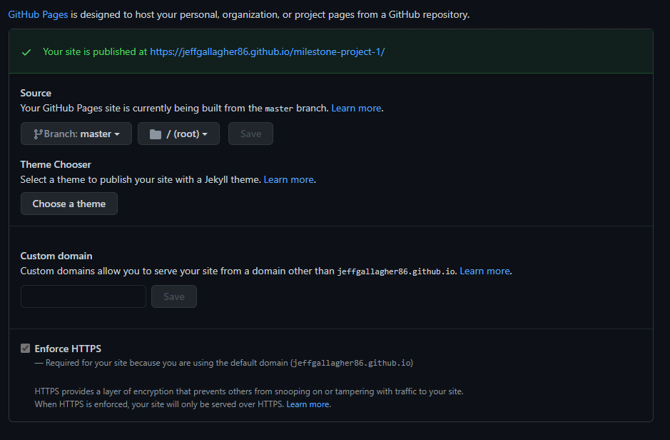

# The Veg Table

The Veg Table is a vegetarian food website which seeks to cater to vegetarians and also people who may wish to become vegetarian or simply for people who may wish to introduce more veggie dishes into their lives.

[View Live Website Here](https://jeffgallagher86.github.io/milestone-project-1/)

# Contents

*
*
*
*
*
*
*
*

# UX
## User Stories

## Site Owners Business Goals

# Features

# Technologies Used

## Languages Used

* [HTML](https://en.wikipedia.org/wiki/HTML5)
* [CSS](https://en.wikipedia.org/wiki/CSS)

# Frameworks, Libraries, Programs and Sites.

* [Bootstrap](https://getbootstrap.com/) - used for Navbar, grid system and styling throughout the site.

* [Photoshop](https://www.adobe.com/ie/products/photoshop.html) - for image editing.

* [Balsamiq](https://balsamiq.com/) - for wireframes.

* [tinypng](https://tinypng.com/) - to reduce the size of the images used.

* [FontAwesome](https://fontawesome.com/) - for the icons used on the site.

* [Google Fonts](https://fonts.google.com/) - for the fonts used.

* [Unsplash](https://unsplash.com/) - for some of the images used on the site.

* [GitHub](https://github.com/) - to host and publish the site.

* [Gitpod](https://gitpod.io/) - Used for version control by utilizing the Gitpod terminal to commit to Git and Push to GitHub.

# Testing

# Deployment

## Publishing Project

This project was deployed to [GitHub](https://github.com/) pages as follows

1. Log-in to GitHub and open the repo for [MS1 The Veg Table](https://github.com/jeffgallagher86/milestone-project-1)
2. Locate and click on the Settings button at the top of the page.
3. Scroll down to the GitHub Pages section on the settings page.
4. Under "Source", click the dropdown called "None" and select "Master Branch".
5. The page will refresh.
6. Scroll down through the page to locate the now published site in the GitHub Pages section to retrieve the link.

## Cloning Project 

1. Log-in to GitHub and open the repo for [MS1 The Veg Table](https://github.com/jeffgallagher86/milestone-project-1)
2. Locate and click on the code section at the top of the page.
3. Click the code button as shown below to show copy of URL

4. Open Git bash terminal.
5. Change the current working directory to the location where you want the cloned directory.
6. Type in "git clone" followed by the copied URL and press enter key to create a local clone.

# Credits

## Media

* Recipe images used from [Jamie Olver's](https://www.jamieoliver.com/) site.

* Pumpkin and Squash Image by Tijana Drndarski taken from [Unsplashed](https://unsplash.com/photos/pZjTMVTGjlc).

* Squash Soup image by Cala taken from [Unsplashed](https://unsplash.com/photos/w6ftFbPCs9I).

* Smashed Avocado Image by Daria Shevtsova taken from [Pexels](https://unsplash.com/photos/w6ftFbPCs9I).

* Hero Image by R.F Studio taken from [Pexels](https://www.pexels.com/photo/photo-of-person-holding-fork-3621221/).

* All of these image where reduced in size using [Tinypng](https://tinypng.com/)

* [Multi-Device Mock Up](http://techsini.com/multi-mockup/index.php) image taken from technisi.

## Code

* Fonts used courtesy of [Google Fonts](https://fonts.google.com/).

* Bootstrap used for Navbar, grid system and styling throughout the site taken from [Bootstrap Docs](https://getbootstrap.com/).

* Icons used in site taken from [Font Awesome](https://fontawesome.com/).

* Some small snippets of code used from users on [Stack Overflow](https://stackoverflow.com/) and [YouTube]( https://www.youtube.com/watch?v=dJQedxalv64).

* Credit also goes to [w3Schools](http://w3schools.com/) for help along the way.

## Content 

* [Jamie Oliver's Roasted Blackbean Burgers](https://www.jamieoliver.com/recipes/vegetable-recipes/roasted-black-bean-burgers/) - Recipe & Image used

* [Jamie Oliver's Summer Tagliatelle](https://www.jamieoliver.com/recipes/pasta-recipes/summer-tagliatelle/) - Recipe & Image used

* [Jessica Chastaine's Tempura](https://www.jamieoliver.com/recipes/vegetable-recipes/jessica-chastain-s-tempura/) - Recipe & Image used

* [Waitrose's Squash and Feta Soup](https://www.waitrose.com/content/waitrose/en/home/recipes/recipe_directory/s/squash-and-feta-soup.html)

## Acknowledgements
* I would like to thank my mentor Akshat Garg for all his help with this project.

* I'd also like to thank all at Code Institute and the CI slack community for all their help along the way.

* Special mention for Anna Greaves for her README webinar also.

**Thank you very much for taking the time to review my work!**

